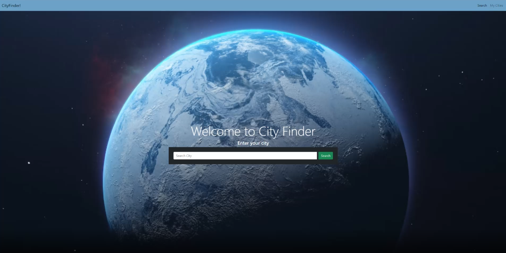
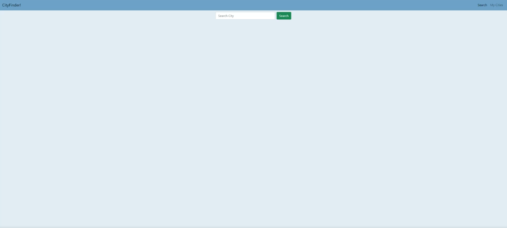
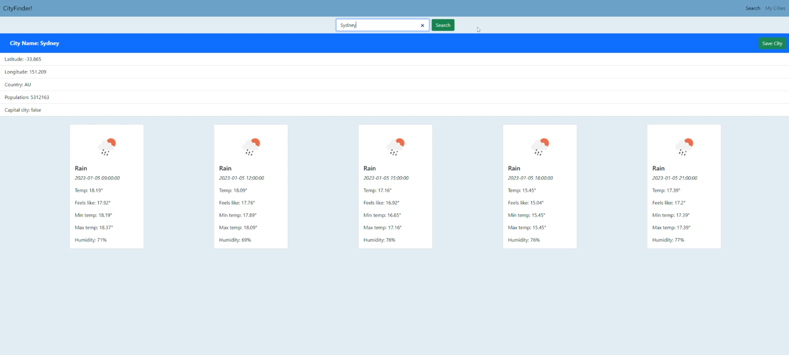

# City Finder
## Project Description
With the criteria of using 2 or more Server-side API's, while also being reactive to users input, we have created a webpage for travellers with the ability to display 
information about any major city chosen.

Based on the criteria provided and API's available, we decided to create City Finder. 

### User Story
```
AS A traveller who wants to know more about potential cities to visit
I WANT to be able to use a website to get an information fact sheet about any city
SO THAT I can save time researching and be informed
```
### Acceptance Criteria
```
Given I need to search a new city
WHEN I type in a city name into the searchbar
THEN a factsheet on the city is brought up and the searchbar moves to the top of the screen

Given I need to see the information of a city
WHEN I search for a city name
THEN a request is made to the API to receive the relevant data (weather + city info), which is displayed on screen

Given I want to save a city’s information
WHEN I click the save city button
THEN it saves to a list which persists across sessions

Given I want to access my saved cities 
WHEN I press the ‘my cities’ button on the navbar
THEN i am taken to a list of my saved cities
WHEN I click on a given city
THEN that cities fact sheet opens up

Given I want to return to search from the my cities tab
WHEN I click the ‘search’ button on the navbar
THEN I am taken to the landing page
```
---

## Application Description 

Our webpage aims to give easily accessible information for cities around to world to potential travellers, who can then save and revisit their favourite choices. 

When users access the webpage there is a searchbar which they can input any city into. Once the city has been entered, the page will redirect to the City display page which will show the 
API data on that particular city, including Population, weather, longitude and latitude. Users then have the option to save the city into their "My Cities" page or input a new city into the search. 
The my cities page will then show all of the saved cities from the user, with each saved city being stored in the clients storage and presenting a small card for each city in the My cities page. 
If an incorrect city name is input into the search bar or is mispelt, then the page will return a "city not found" error. 

## Features
- Page will display city information for each city input
- Weather cards are displayed showing the cities weather for the current day
- Save button allows cities to be stored in clients storage
- Saved cities will appear on My Cities page
- A snippet of inofrmation of the city will show adjacent to the city on the My cities page
- City name will be a link that will redirect back to the search result for the city
- Nav elements will direct to either landing page or My Cities page

### City finder uses the following API's:
- [City API](https://api-ninjas.com/api/city): Which gives acces to city information such as Country name, population and latitude and longitude.
- [Weather API](https://api-ninjas.com/api/weather): This API takes the output longitude and latitude from City API as its input and provides a card display of 
    the current weather in the city chosen.
- [Unplash API](https://unsplash.com/developers): Adds images to each city on the My Cities page filtered by the city name and displays it within the city card. 
- [Momentjs API](https://momentjs.com/docs/): Displays the current time on the webpage. 

## Screenshots 

Working screenshot of City Finder Landing page



City display page before any city has been entered



City Display page after API's have been called


My Cities page with no saved cities


My Cities page with several saved cities, displaying the unsplashed API images


---
### [Deployed Link](https://niktern.github.io/Project-1-CityFinder/)
---

## Future Features
- Interactive map on landing page with clickable cities, as an alternative to searching cities
- Tripadvisor APi link to display top sites within each city
- Country information to be displayed on City Display page (Currency, language, exchange rate etc)
- City news API integration to show latest news on display page
- UI improvements
- Exportable notes section in My cities page to allow users to plan upcoming trips
- Flight tracker API to show flight times and link to potential booking websites
---

## Group GitHub Profiles
- Nik - https://github.com/NikTern 
- Morgan - https://github.com/mqas1 
- Haillander - https://github.com/Haillander 
- Michael - https://github.com/Mbosse97  